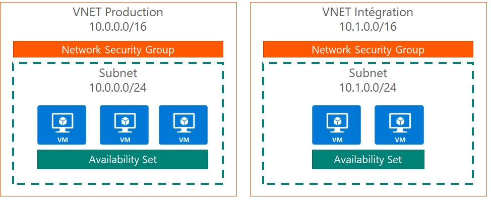

# Terraform Quick Start on Azure

<!-- toc -->

- [Terraform Quick Start on Azure](#terraform-quick-start-on-azure)
  - [Prerequisites](#prerequisites)
  - [What is Terraform ?](#what-is-terraform-)
  - [Terraform install](#terraform-install)
    - [Manual install](#manual-install)
    - [Install using Chocolatey (recommended)](#install-using-chocolatey-recommended)
  - [Exercise 1 : Terraform initialization and creation of a resourge group](#exercise-1--terraform-initialization-and-creation-of-a-resourge-group)
  - [Exercise 2 : Creation of a Virtual Network](#exercise-2--creation-of-a-virtual-network)
  - [Exercice 3 : Variables and functions](#exercice-3--variables-and-functions)
  - [Exercice 4 : Workspaces](#exercice-4--workspaces)
  - [Exercice 5 : Build a set of virtual machines](#exercice-5--build-a-set-of-virtual-machines)
    - [Availability set](#availability-set)
    - [Network Security Group](#network-security-group)
    - [Virtual Machine](#virtual-machine)
    - [Replicate Virtual Machines](#replicate-virtual-machines)
    - [Optional : Add an Azure Load Balancer](#optional--add-an-azure-load-balancer)
  - [Exercice 5bis (optional): Use foreach instead of count](#exercice-5bis-optional-use-foreach-instead-of-count)
  - [Exercice 6 : Remote Tfstate](#exercice-6--remote-tfstate)
  - [Exercice 7 : Working with an existing infrastructure](#exercice-7--working-with-an-existing-infrastructure)
    - [Using Datasources](#using-datasources)
    - [Importing existing resources](#importing-existing-resources)
  - [Exercice 8 (optionnal) : CI / CD with Azure DevOps](#exercice-8-optionnal--ci--cd-with-azure-devops)
    - [Create an App registration](#create-an-app-registration)
    - [Create a git repository](#create-a-git-repository)
    - [Deploy the prod infrastructure through a pipeline](#deploy-the-prod-infrastructure-through-a-pipeline)
      - [Prerequisite : Create a variable group](#prerequisite--create-a-variable-group)
      - [Option 1 : Use a Terraform extension](#option-1--use-a-terraform-extension)
      - [Option 2 : Use a Container Job](#option-2--use-a-container-job)
  - [Exercice 8 (optionnal) : CI / CD with Github Actions](#exercice-8-optionnal--ci--cd-with-github-actions)
    - [Create a Managed Identity](#create-a-managed-identity)
    - [Create a git repository](#create-a-git-repository-1)
  - [What to do next](#what-to-do-next)
  - [References](#references)

<!-- tocstop -->

## Prerequisites

- An active Azure subscription (with administrator privileges)
- Visual Studio Code
  - Terraform extension : <https://marketplace.visualstudio.com/items?itemName=HashiCorp.terraform>
- Azure CLI : <https://docs.microsoft.com/en-us/cli/azure/install-azure-cli-windows?view=azure-cli-latest>
- Git (optional) : <https://git-scm.com/download/win>
- Terraform documentation for Azure : <https://www.terraform.io/docs/providers/azurerm/>

## What is Terraform ?

"*Terraform is a tool for building, changing, and versioning infrastructure safely and efficiently.*" (cf documentation).

 It's just a CLI ! You just have to describe your infrastructure in one or many files using HCL (HashiCorp Configuration Language), and use the CLI to build it, change it, etc...

## Terraform install

### Manual install

- Download the package on the official website : <https://www.terraform.io/downloads.html>
- Update the PATH to make the terraform binary available : <https://stackoverflow.com/questions/1618280/where-can-i-set-path-to-make-exe-on-windows>

### Install using Chocolatey (recommended)

Chocolatey is a Windows Package Manager. It can be used to install Terraform.

You can install Chocolatey with PowerShell using this command line : <https://chocolatey.org/install#install-with-powershellexe>

```powershell
Set-ExecutionPolicy Bypass -Scope Process -Force; iex ((New-Object System.Net.WebClient).DownloadString('https://chocolatey.org/install.ps1'))
```

Then you can install Terraform

```bash
choco install terraform
```

---
## Exercise 1 : Terraform initialization and creation of a resourge group

A terraform project is made of a collection of `*.tf` files. Terraform files are written using HCL (HashiCorp Configuration Language)

**Create an empty folder - this will be the project folder for all the exercices**, then create the file `main.tf`

```bash
# Declaration of the providers
terraform {
  required_providers {
    azurerm = {
      source  = "hashicorp/azurerm"
      version = ">= 3.0.0, < 4.0.0"
    }
  }
}

# Configuration of Azure provider
provider "azurerm" {
  features {}

  subscription_id = "<subscription_id>"
}

resource "azurerm_resource_group" "rg_training" {
   name = "rg-training"
   location = "West Europe"
}
```

- The first block declares which Terraform providers will be used
- The second block configure the `azurerm` provider declared in the first block
- The third block will create a resource group named `rg-training`

Open a terminal, and go to the directory you just created.

The first step is to initialize the Terraform project. Run the following command :

```bash
terraform init
```

Terraform will download the latest vestion of the Azure provider, and create a `.terraform` folder where all the artefacts needed to run Terraform will be stored. This folder must be present in the `.gitignore` file if you want to use Git.

Authenticate to your Azure Subscription using the Azure CLI (this won't work with a PowerShell command)

```bash
az login

# If you have more than one subscription associated with your account and didn't specify any in the configuration block, select the one you want to use
az account set --subscription <subscription_id>
```

Once you're authenticated on Azure, run the following command :

```bash
terraform plan
```

This command won't do anything on Azure, but it will show you what's going to be done, like a dry run. You should see that one resource group will be created, and no resource will be updated or deleted.

In order to apply the modifications on Azure, run the command :

```bash
terraform apply

# Type yes to confirm
```

Using the command `az group list` or directly in the Azure Portal, you should now see the resource group `rg-training`

A `terraform.tfstate` file has been created at the root of the folder. It contains the state of your infrastructure deployed with your Terraform project. One again, don't put this file in your Source Control, even if you are more than one working on the project. You will see later how to store it to work in a distributed way.

---
## Exercise 2 : Creation of a Virtual Network

We will add a Virtual Network and a Subnet in our resource group. Create a second file named `vnet.tf` and add the following resources :

```bash
resource "azurerm_virtual_network" "vnet_training" {
  name                = "vnet-training"
  location            = "West Europe"
  resource_group_name = azurerm_resource_group.rg_training.name
  address_space       = ["10.0.0.0/16"]
}

resource "azurerm_subnet" "subnet_training" {
  name                 = "subnet-training"
  resource_group_name = azurerm_resource_group.rg_training.name
  virtual_network_name = azurerm_virtual_network.vnet_training.name
  address_prefixes     = ["10.0.1.0/24"]
}
```

Run the command `terraform plan`

Since the resource group is already there, Terraform will only create 2 additional resources.

Run `terraform apply`

Once you've checked that all the resources have been created correctly, destroy everything using the command `terraform destroy`.

> Optional : Add a tag for the virtual network (for example 'environment = "prod"')

---
## Exercice 3 : Variables and functions

We will add a Network Interface in our subnet, and introduce the use of variables and built-in functions.

First, we will create a file named `variables.tf` where we will declare all the variables we're going to use, with a default value. Then, we will create a `Network Interface Card` and use those variables. Finally we will create a file named `values.tfvars` which will contain the values of the variables (used to overwrite default values or when no default value is provided).

For example, we will declare the `location` variable, set the default value to `West Europe`, and use it for every resources we have.

> To use a variable in your Terraform code, use the syntax `var.<variable_name>` ex: `var.location`

Perform the following tasks :


- Add a `variables.tf` file and declare the `location` and `vnet_address_space` variable with a default value set to `West Europe` for the location. If you set a `default` value, Terraform will deduce its `type`.

```bash
variable "location" {
  default = "West Europe"
}

variable "vnet_address_space" {
  type = list(string)
}

variable "subnet_prefixes"{
  type = list(string)
}
```

- Add a `nic.tf` file and add a Network Interface using the following snippet or the one in the official Terraform documentation

```bash
resource "azurerm_network_interface" "example" {
  name                = "example-nic"
  location            = "West Europe"
  resource_group_name = azurerm_resource_group.example.name

  ip_configuration {
    name                          = "internal"
    subnet_id                     = azurerm_subnet.example.id
    private_ip_address_allocation = "Static"
    private_ip_address            = cidrhost(element(azurerm_subnet.subnet_training.address_prefixes, 0), 10)
  }
}
```

The `element` function allows you to select an element within a `list` object, and the [`cidrhost` function](https://www.terraform.io/language/functions/cidrhost) to calculate an address using a range of IPs.

- In each `.tf` file (main, nic, vnet), replace hardcoded values with variables. 

- Create a file `values.tfvars` which will contain values for the variables, using the following syntax :

```bash
var_01 = "value01"

var_02 = "value02"

var_03 = "value03"
```

Run the commands :

```bash
terraform plan --var-file="values.tfvars"
terraform apply --var-file="values.tfvars"
```

Once you've checked that everything is deployed correctly, run a `terraform destroy`.

> Tips : Use the `variables.tf` file to declare variables that are used globally accross tf files. If a variable is only used in a single `.tf` file, like, for example, the `vnet_address_space`, declare it directly in the same `.tf` file. Doing this, you can differentiate global and local variables, even if in the end, it's the same for the Terraform engine.

---
## Exercice 4 : Workspaces

Workspaces allow you yo have multiple version of the same infrastructure. It's used, for example, to create a Production environment, a Development environment, etc...

Every workspace has a dedicated `.tfstate` file.

The goal of this exercise is to create two workspaces : **prod** and **dev**. For each workspace, we will create a dedicated `.tfvars` file, in order to have different values for each environment.

- Create a  `dev.tfvars`, copy / paste the content of the `values.tfvars` file, and change the values.
- Rename the `values.tfvars` in `prod.tfvars`
- Create two workspaces with the command `terraform workspace new <workspace_name>`
- Update all the tf **resources names** with the variable `terraform.workspace` in order to identify the workspace of the resource. For example, in the `main.tf` file :

```bash
resource "azurerm_resource_group" "rg_training" {
  name     = "rg-${terraform.workspace}-training"
  location = var.location
}
```

- Deploy the two environments on each workspaces

> To check the current workspace, use the commande `terraform workspace show`

> To see the list of workspaces, and which one of them is selected, use the command `terraform workspace list`

> To switch between workspaces, use the command `terraform workspace select <workspace_name>`

---
## Exercice 5 : Build a set of virtual machines

The goal is to continue the previous exercise to build the following infrastructure :



The virtual machines must have the following configuration :

| Property | Value |
| --- | --- |
| vm_size | "Standard_DS2_v2" (permet d'avoir des disques Premium) |
| OS publisher | "Canonical" |
| OS offer | "UbuntuServer"|
| OS sku | "18.04-LTS" |
| OS version | latest |
|managed_disk_type |"Premium_LRS" |

You're required to make it easy to add another virtual machine later.

### Availability set

Create a file named `availability_set.tf` and add the resource. Set the `managed` property to true in order to be able to use managed disks later.

```bash
resource "azurerm_availability_set" "example" {
  name                = "example-aset"
  location            = azurerm_resource_group.example.location
  resource_group_name = azurerm_resource_group.example.name
  managed             = true
}
```

Don't forget either to put the workspace name in the name of the resource, so we don't have duplicate later.

### Network Security Group

Create a file named `nsg.tf` and add a network security group resource.

```bash
resource "azurerm_network_security_group" "example" {
  name                = "acceptanceTestSecurityGroup1"
  location            = azurerm_resource_group.example.location
  resource_group_name = azurerm_resource_group.example.name
}
```

Add the nsg to the subnet using the `azurerm_subnet_network_security_group_association` resource

```bash
resource "azurerm_subnet_network_security_group_association" "example" {
  subnet_id                 = azurerm_subnet.example.id
  network_security_group_id = azurerm_network_security_group.example.id
}
```

### Virtual Machine

Create a file named `vm.tf` and add a virtual machine resource with the spec defined earlier. When creating a virtual machine using terraform, use the `azurerm_linux_virtual_machine` or the `azurerm_windows_virtual_machine` resource.

> Check the available Azure VM image SKUs with az cli command, such as `az vm image list-skus -l westeurope -f UbuntuServer -p Canonical`

> When an `admin_password` is specified, `disable_password_authentication` must be set to false. ~> NOTE: One of either admin_password or admin_ssh_key must be specified.

```bash
resource "azurerm_linux_virtual_machine" "main" {
  name                            = "vm"
  location                        = azurerm_resource_group.main.location
  resource_group_name             = azurerm_resource_group.main.name
  size                            = "Standard_D2s_v3"
  admin_username                  = "azureuser"
  network_interface_ids           = [azurerm_network_interface.main.id]
  availability_set_id             = azurerm_availability_set.main.id

  disable_password_authentication = false
  admin_password                  = "Some-Secret-You-Dont-Commit-In-Git"
  
  # run keygen.sh with bash
  # use password mode as alternative in case of difficulty
  # admin_ssh_key {
  #   username   = "azureuser"
  #   public_key = file("~/.ssh/id_rsa.pub")
  # }

  # identity {
  #   type = "SystemAssigned"
  # }

  os_disk {
    name                 = "myosdisk1"
    caching              = "ReadWrite"
    storage_account_type = "Standard_LRS"
  }

  source_image_reference {
    publisher = "Canonical"
    offer     = "UbuntuServer"
    sku       = "18.04-LTS"
    version   = "latest"
  }
}
```

A few things to note :

- The hostname will be identical to the vm name.
- The login of the VM cannot be **admin**

### Replicate Virtual Machines


Now that you have a virtual machine, use the `count` keyword to duplicate it.

- Declare a variable to define the number of virtual machines you need.
- Use the variable in each resource that needs to be duplicated, and the `count.index` property to iterate
- In your virtual machine resource, you will have to reference a nic. Use the array syntax with the `count.index` property

At the end of the exercise, delete the infrastructure on both workspaces.

### Optional : Add an Azure Load Balancer

Add a public Azure Load Balancer with a public IP, and a rule to load balance TCP traffic on the port 80 of your virtual machines. Don't forget to open the port 80 on your NSG.

## Exercice 5bis (optional): Use foreach instead of count

The usage a the keyword `count` may be problematic in some scenarios, where all the instances of the resource are not meant to be the same For example, you may want to create multiple virtual machine, with a different role (web, backend, database,...). For this scenario, you should use the `for_each` property.

Documentation : <https://www.terraform.io/docs/language/meta-arguments/for_each.html>

- Use a variable of type `map` to declare the list of the VMs you want to create
  
```bash
variable "vms" {
  type = map(object({
    name  = string
    ip_index = number
    }
  ))
}
```

- Give a value to this variable in `.tfvars` files

```bash
vms = {
  vm01 = {
    name     = "frontend"
    ip_index = 0
  },
  vm02 = {
    name     = "backend"
    ip_index = 1
  },
  vm03 = {
    name     = "database"
    ip_index = 2
  }
}
```

- Replace the `count` property with `for_each` using the `map` variable you just created (the index property in the `map` variable should be use to replace the `count.index` when calculating the private IP address)

---
## Exercice 6 : Remote Tfstate

Until now, the `.tfstate` file, which save the state of the infrastructure, is stored locally. This is a problem when you're not the only one working on the Terraform project, or when you use a CI / CD pipeline to deploy your infrastructure (executed in a stateless agent).

Terraform allow you to store the `.tfstate` remotely, so you can share it with the rest of your team.

On Azure, Terraform supports to store the `.tfstate` in a Blob Storage.

On the Azure side, you have to :

- Create a Blob Container in a Storage Account (manually, without Terraform)
- Grab one of the 2 admin keys

On the Terraform side, you have to :

- Modify the `main.tf` file to add the backend config (which host the `.tfstate`), add the backend block

```bash
terraform {
  required_providers {
    azurerm = {
      source = "hashicorp/azurerm"
    }
  }
  backend "azurerm" {
    storage_account_name = "abcd1234"
    container_name       = "tfstate"
    key                  = "training.terraform.tfstate" # the value can be anything
  }
}

provider "azurerm" {
  features {}

  # subscription_id = "subscription_id"
}
```

- Create a `backend.secrets.tfvars` file, containing the infos to connect to the storage account.

According to the Terraform documentation, you  have multiple ways to authenticate for the backend configuration. We'll use the admin key we got earlier :

```bash
access_key = "key"
```

Initialize the backend to take into account the modifications. If you have an error, delete the `.terraform` folder and try again.

```bash
terraform init --backend-config="backend.secrets.tfvars"
```

Redeploy the whole infrastructure.

---
## Exercice 7 : Working with an existing infrastructure

The goal of this exercise is to show how Terraform can be used with an infrastructure that already exists. You have two ways of doing that. Either by referencing the existing resources in your code using `datasources`, or by importing the existing resources in your `tfstate` using the `terraform import` command.

> We will work on the `dev` workspace only during this exercise

### Using Datasources

The goal is to create a Storage Account using Terraform, in a Resource Group that already exists in Azure.

- Create a `Resource Group` using the **Azure Portal** using the name :
  - Name : `rg-<workspace_name>-training-storage
  - Location : `West Europe`
- Add a `datasources.tf` file in your Terraform project and add a reference to the `Resource Group`

```bash
data "azurerm_resource_group" "rg_training_storage" {
  name = "rg-dev-training-storage"
}
```

- Add a `storage.tf` file and create a Storage Account using the [documentation](https://registry.terraform.io/providers/hashicorp/azurerm/latest/docs/resources/storage_account)
  - The `resource_group_name` metadata must reference the Resource Group using the syntax `data.azurerm_resource_group.rg_training_storage.name`
  - Note : The Storage Account Name must be unique accross Azure, and without special characters (ex: sadevtraining123)
- Run a `terraform apply` with the usual parameters

### Importing existing resources

The goal is now to import the resource group within our Terraform project

- First, add in your `main.tf` file the Terraform code to create the Storage Account we created manually when using `datasources`.

```bash
resource "azurerm_resource_group" "rg_training_storage" {
  name     = "rg-dev-training-storage"
  location = var.location
}
```

- Update your code to remove the datasource and instead reference the resource group like we did in previous exercises.
  - Change `data.azurerm_resource_group.rg_training_storage.name` to `azurerm_resource_group.rg_training_storage.name`
- Delete the datasource

```bash
data "azurerm_resource_group" "rg_training_storage" {
  name = "rg-dev-training-storage"
}
```

- Import the Resource Group within the tfstate using the `terraform import` [command](https://developer.hashicorp.com/terraform/cli/commands/import)
  - The command should be `terraform import --var-file=dev.tfvars <terraform_resource_id> <azure_resource_id>`
    - The `terraform_resource_id` is the id in your Terraform code : `azurerm_resource_group.rg_training_storage`
    - The `azure_resource_id` is the Azure ID of the resource (available in the portal) and can be retrieved using the `azure cli`.

```bash
az group show --name <resource_group_name> --query id
```

> If your account has access to multiple Azure Subscription, use the command `az account set --subscription <subscription_id>` to target the subscription where the storage account is.

The ID should look like : `/subscriptions/<subscription_id>/resourceGroups/rg-dev-training-storage`

---
## Exercice 8 (optionnal) : CI / CD with Azure DevOps

The goal of this exercise is to run the build of your production infrastructure from Azure DevOps. You need an Azure DevOps project for this exercise, and admin privileges to install extensions for option 1 (you don't need it for option 2).

### Create an App registration

Since we can't have an interactive login during a pipeline, we need an App Registration. You'll need the following properties :

- Client ID
- Client Secret
- Tenant ID

### Create a git repository

Create a `.gitignore` file at the root of your working folder with the following content, in order to avoid secrets or unecessary files in the repository.

```bash
**/.terraform/*
**/secrets/*
**/backend/*
*.secrets.*
*.secrets
*.secret.*
*.secret
*.tfstate
*.tfstate.*
*.lock.*
```

In your Azure DevOps project, create an empty projet, then push your code in the (default) repository.

```bash
git init
git add .
git commit -am "Initial Commit"
git remote add origin <your git repository>
git push -u origin --all
```

### Deploy the prod infrastructure through a pipeline

There's a lot of different ways to deploy a Terraform infrastructure in a pipeline.

The first one is the fastest and easiest one. We'll use a Terraform extension from the Azure DevOps Marketplace. However, this is not the safest way.

The second one will use Container Jobs. We'll use our own container to run the Terraform commands.

#### Prerequisite : Create a variable group

Since we don't want to commit any secrets (no, we don't) or configuration values in our git repository, we'll use environment variable to authenticate to our backend and to our azure subscription. Terraform support using environment variable for that ( <https://registry.terraform.io/providers/hashicorp/azurerm/latest/docs/guides/service_principal_client_secret> ).

You can either create variables at the pipeline level, or create variables across pipelines using variable groups. Since we'll create two pipelines, we'll use a variable group. Create one and set the value for the following variables:

```bash
ARM_CLIENT_ID
ARM_CLIENT_SECRET
ARM_SUBSCRIPTION_ID
ARM_TENANT_ID
ARM_ACCESS_KEY
```

#### Option 1 : Use a Terraform extension

There's a bunch of Terraform extensions available in the Azure DevOps marketplace. The best one at the moment (June 2020) seems to be the one written by `Charles Zipp` : <https://marketplace.visualstudio.com/items?itemName=charleszipp.azure-pipelines-tasks-terraform>. It works for Linux and Windows agents (it's not the case for all Terraform extensions in the Marketplace).

Install the extension, then create a new pipeline

- Select your repository
- Select `Starter Pipeline`

Once you're in the pipeline editor :

- Add the variable group to your pipeline

```bash
variables:
- group: TF
```

- Drag & Drop the Terraform tasks to Install Terraform, and do an `init` using your remote backend.
- Since there's no option to select a workspace using the Terraform extension, use the Command Line task to perform the rest of the actions (select prod workspace, apply)

Using an extension can be problematic :

- Buggy updates of the extension can break your pipeline since you always use the latest version of the extension, and the extension is installed at the organization level.
- The installation of an extension can bring names conflicts (for example if two extensions have a task named `TerraformInstaller`), and again, break pipelines accross the organization.
- You don't usually have the permissions to manage extensions on an Azure DevOps organization.

#### Option 2 : Use a Container Job

Using a container allows you to have a better control of the context where your tasks run.

In our case, we want a container with Terraform already installed (to run faster, and not take the risk at each pipeline execution that the Terraform repository is unavailable), and we don't want to use extensions anymore (a container is not mandatory for that).

The prerequisites for a container to be used as a build agent are listed there <https://docs.microsoft.com/en-us/azure/devops/pipelines/process/container-phases?view=azure-devops>. Bottom line is: use an `ubuntu` container on a `ubuntu-18.04` host.

An example of a `Dockerfile` can be found there : <https://github.com/ludovic-m/azure-devops-tf-container-agent/blob/master/Dockerfile>

You can either build your own image, store it on Docker Hub or an Azure Container Registry, or you can use the image built using the Dockerfile mentionned before: `ldvcm/azure-devops-tf-agent`

## Exercice 8 (optionnal) : CI / CD with Github Actions

- Create Github repo
- Git Init
- Setup remote & push
- Setup UMI
- Write Workflow

### Create a Managed Identity

Since we can't have an interactive login during a pipeline, we'll use a Managed Identity. Also, to avoid storing any secret in Github (even from Environment variables), we'll use Workload Identity Federation.
Once the managed identity is created in your Subscription, add a Federated Credential using the following properties :

- Federated credential scenario : `Configure a Github issued token to impersonate this application and deploy to Azure`
- Organization : `<name of your github org - ex: ludovic-m>`
- Repository: `<name of the repository where your Terraform code is pushed>`
- Entity: `Environment`
- Environment: `production`

> The entity and the environment properties suppose that you'll add a metadata `environment` with `production` as value in your Github Actions Workflow

Get the Client ID and the Tenant ID of your Managed Identity (The tenant id is visible by going to the `Microsoft Entra ID` blade)

### Create a git repository

Create a `.gitignore` file at the root of your working folder with the following content, in order to avoid secrets or unecessary files in the repository.

```bash
**/.terraform/*
**/secrets/*
**/backend/*
*.secrets.*
*.secrets
*.secret.*
*.secret
*.tfstate
*.tfstate.*
*.lock.*
```

In your Github Org, create an empty projet, then push your code in the `main` branch.

```bash
git init
git add .
git commit -am "Initial Commit"
git remote add origin <your git repository>
git push -u origin --all
```

## What to do next

The following subjects were not covered, but can be useful in a Terraform project (not exhaustive) :

- **Datasources**: If everything is not deployed using Terraform, or instead of putting everything in a single Terraform project, split your Terraform projects and use Datasources to get resources already existing in Azure.
- **Local variables**: You can declare local variables (which can be calculated using others variables) that can be used accross all your project, without having the risk of the variable value being overwritten by a configuration file.
- **Resources Import**: You can import existing resources in your Terraform project. It's useful if you want to include something in your Terraform project without having to recreate it (it does not generate a configuration, just import the resource as is in the state)
- **Modules**: It's a container for multiple resources that are used together. For example, if you have multiple multiple reverse proxies accross your solution, you can build a Reverse Proxy module and use it each time you need it without having to declare each time all the ressources (Virtual Machine, NIC, NSG, etc...).
  
## References

- [Hashicorp Learn](https://learn.hashicorp.com/terraform?track=azure#azure)
- [Terraform azurerm Provider Documentation](https://registry.terraform.io/providers/hashicorp/azurerm/latest/docs)
